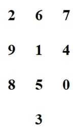

## Wat heb je nodig?

- Een blad of kaart met 10 genummerde fixatiepunten, zoals op een rekenmachine (zie afbeelding).

## Zo doe je de oefening:

- Kijk eerst naar het middelste getal (in dit voorbeeld de **1**) – dit is het startpunt.
- Beweeg daarna uw **ogen** naar het getal **2**, terwijl uw hoofd stil blijft.
- Beweeg daarna uw **hoofd** in dezelfde richting.

## Variaties:

- Doe nu alleen de **oneven getallen**: 1, 3, 5, 7, 9.
- Dan de **even getallen**: 0, 2, 4, 6, 8.

## Extra tip:

- Kies een **keertafel**, bijvoorbeeld de **tafel van 7**. Kijk naar **7**, daarna naar **14** (dus eerst 1 en daarna 4), dan **21** (2 en 1), enzovoort.
- Als dit goed gaat, probeer dan uw **ogen en hoofd tegelijk** te bewegen, zodat ze weer beter gaan samenwerken.
